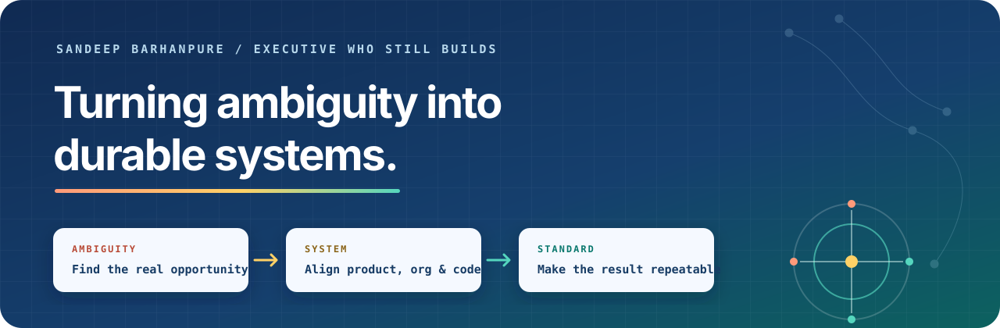

  

  <a href="https://sbarhanpure.com"><strong>Portfolio</strong></a> ·
  <a href="https://www.terrainailabs.com">Terrain AI Labs</a> ·
  <a href="https://www.linkedin.com/in/sandeepbarhanpure">LinkedIn</a> ·
  <a href="mailto:sandeep@terrainailabs.com">Email</a>

I build platforms that let other people build—and ship AI before it is obvious. The through-line across 16 years in Fortune 1 retail, hyperscale cloud, healthcare, and financial services is not a domain. It is a pattern: find the under-leveraged opportunity, build the product or system to capture it, then make it the standard.

Today I lead software engineering portfolios at **Walmart Health & Benefits Technology** and build hands-on at **Terrain AI Labs**. I run organizations. I still write code. Leaders who stop building eventually stop knowing which questions to ask.

## Different industries. Same approach.

<table>
  <tr>
    <td width="33%"><strong>50-person organization</strong> Led engineering across contract management and customer analytics at AWS.</td>
    <td width="33%"><strong>80% less overhead</strong> Consolidated five-plus enterprise systems into one contract platform.</td>
    <td width="33%"><strong>6 months → under 4 weeks</strong> Cut benefit-program onboarding through a self-serve builder platform.</td>
  </tr>
  <tr>
    <td width="33%"><strong>30-person organization from zero</strong> Built MTM Health's engineering and data-science capability.</td>
    <td width="33%"><strong>9% → under 3%</strong> Reduced missed trips with a real-time dispatching platform.</td>
    <td width="33%"><strong>25+ leaders developed</strong> People I managed now run organizations of their own.</td>
  </tr>
</table>

## What I'm building

| Product | What it does | Where it is now |
| --- | --- | --- |
| **[Member360](https://member360.ai)** [Product story](https://sbarhanpure.com/products/member360) | Explains what happened after a health claim is adjudicated, who needs to act, and what to do next—without guessing when evidence is missing. | `LIVE PROTOTYPE` Synthetic examples; no member data requested. |
| **[Ask Niko](https://askniko.ai)** [Product story](https://sbarhanpure.com/products/ask-niko) | Brings Strava activity, Oura or WHOOP recovery, and weather into one evidence-backed daily training conversation. | `CLOSED BETA` Public interactive demo with sample data. |
| **[Cadence AI](https://www.terrainailabs.com/products/cadence)** [Product story](https://sbarhanpure.com/products/cadence-ai) | Reads across property, pricing, cleaning, and accounting workflows, then prepares the next action for human approval. | `IN DAILY USE` One operating partner; approval before every external write. |

## Where I've built

| | Scope | What changed |
| --- | --- | --- |
| **Walmart** 2024–now | Director, Software Engineering · Health & Benefits Technology | Built a self-serve platform for launching benefit programs and shaped a greenfield business line from first principles. |
| **AWS** 2021–2024 | Engineering & Analytics · 50-person organization | Shipped GenAI contract automation in early 2022, unified fragmented enterprise systems, and improved deal velocity by 25%. |
| **MTM Health** 2015–2021 | First data hire → engineering and analytics leader | Built a 30-person organization, real-time operations systems, and the company's first commercial SaaS product. |
| **RBL Bank** 2010–2013 | Pricing & Operations | Created pricing, reporting, and risk frameworks that became institutional operating standards. |

## How I operate

- **Find the opportunity nobody owns.** The best work often starts in the whitespace between the org chart and the customer problem.
- **Write the product narrative before the specification.** If the user, pain, and changed behavior are unclear, the work is not ready.
- **Build the smallest thing that proves the thesis.** A prototype should answer a question, not impersonate a finished platform.
- **Treat architecture as bets about what will not change.** Keep everything else cheap to revise.
- **Build paved roads, not toll booths.** Standards should increase safe throughput, not centralize control.

## Tools I reach for

**Product & AI** · Agentic systems · RAG · evals · human-in-the-loop workflows · enterprise SaaS 
**Engineering** · Python · TypeScript · React · Node.js · PostgreSQL · event and data platforms 
**Infrastructure** · AWS · Azure · GCP · Docker · Kubernetes · Terraform · GitHub Actions 
**Domains** · Healthcare EDI · HIPAA · benefits · financial products · endurance training science

---

  <strong>Building something ambiguous?</strong> 
  <a href="mailto:sandeep@terrainailabs.com">Start a conversation</a> ·
  <a href="https://sbarhanpure.com">See the full body of work</a>

